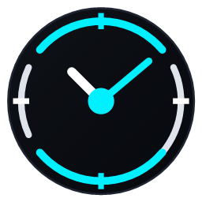
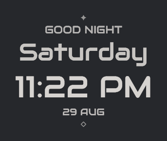
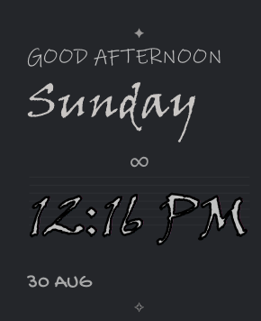

<div align="center">
  
  <h1>DesktopClock Widget</h1>
</div>

A lightweight, customizable Windows desktop clock widget with advanced typography, custom blocks, dynamic scheduled messages, and visual text effects.




---

## Features

- **Stable Visual Anchor**: Centered coordinate anchoring (`AnchorX`, `AnchorY`) guarantees **zero position drift** regardless of time width changes (`01:11 PM` vs `12:59 AM`), dynamic greeting updates, weekday text lengths, custom message rotations, scale adjustments, or font changes.
- **Per-Element Customization**: Independent typography controls for **Greeting**, **Weekday**, **Time (Hero)**, and **Date**:
  - Font family, font weight, size, color, opacity, and text casing (Upper / Lower / Title / None).
- **Curated 146 Font Catalog**:
  - Over 140 distinctive, bundled open-source fonts across Futuristic, Athletic, Condensed, Minimal, Monospace, Serif, Display, Handwritten, and Script styles.
  - Full search, category filter, and font favorites (`★`).
  - Seamless fallback support for Windows system-installed fonts.
- **Per-Element Visual Effects**:
  - **Glyph Outline**: Sharp, sub-pixel vector border around letter contours.
  - **Cyber Glitch**: Chromatic ghost channels (Cyan / Magenta) with subtle displacement jitter.
  - **Digital Noise**: Micro-scanlines and luminance modulation.
  - **Built-in Presets**: *Clean*, *Outlined*, *Cyber Glitch*, *Heavy Glitch*, *Subtle Noise*, and *Digital Distortion*.
- **Custom Decoration & Rotating Blocks**:
  - 12 flexible screen positions (*Above/Below Widget, Above/Below Time, Left/Right of Widget, etc.*).
  - Add symbols (`✦`, `✧`, `◇`, `◆`, `⟡`, `•`, `○`, `△`, `∞`, etc.) with automatic fallback rendering.
  - Static text reminders, sequential rotating messages, random rotation, and fixed time-of-day schedules.
- **Desktop Overlay & Hotkeys**:
  - Transparent click-through overlay mode.
  - Press `Ctrl + Alt + C` anytime to toggle interactive drag-and-drop edit mode.
  - Built-in system tray icon with one-click settings, screen centering, and lock controls.
- **Resource Efficient**:
  - Single-process architecture, low memory footprint, and near-zero idle CPU usage.
  - Shared animation scheduler that completely stops when no animated effects are active.
  - Optional run-at-startup support.

---

## Requirements

- **Operating System**: Windows 10 / 11 (or Windows 7 SP1+ / 8.1)
- **Runtime**: Microsoft .NET Framework 4.0 or higher (pre-installed on all modern Windows versions)

---

## Installation & Usage

### Portable Installation
1. Download `DesktopClockWidget-v1.0.1-portable.zip` from the [Releases](https://github.com/AhmadShehada-bit/DesktopClockWidget/releases) page.
2. Extract the archive to any folder (e.g. `C:\Tools\DesktopClock` or `%LOCALAPPDATA%\DesktopClock`).
3. Run `DesktopClockWidget.exe`.

### Positioning the Clock
- **Edit / Drag Mode**: Press `Ctrl + Alt + C` (or right-click the system tray icon and select **Edit Position**). A faint border appears; click and drag the widget anywhere on your desktop.
- **Lock Position**: Press `Ctrl + Alt + C` again to lock the widget in place. It becomes click-through and seamlessly blends with your wallpaper.
- **Center on Screen**: Right-click the tray icon and select **Center on Screen**.

### Customizing Appearance
- Right-click the tray icon and choose **Settings...** (or right-click the clock in Edit Mode).
- **General Tab**: Global font override, global color override, master scale (40% - 300%), and dynamic greeting hours.
- **Core Elements Tab**: Customize font, size, color, opacity, text casing, and effects (*Outline / Glitch / Noise*) independently for Greeting, Weekday, Time, and Date.
- **Custom Blocks Tab**: Add, duplicate, delete, and reorder decoration blocks, quotes, or schedule notifications.
- **Font Catalog Tab**: Explore and preview 140+ curated app fonts and host system fonts.

---

## Building from Source

### Using Command Line (`build.bat`)
Run the included `build.bat` script from the project root:
```bat
build.bat
```
The output executable will be compiled to `bin\Release\DesktopClockWidget.exe`.

### Using MSBuild / Visual Studio
```bat
msbuild src\DesktopClockWidget\DesktopClockWidget.csproj /p:Configuration=Release
```

---

## Performance & Privacy

- **100% Offline**: Zero external telemetry, network requests, or tracking.
- **Zero Idle CPU**: Clock updates once per second; text effects scheduler halts automatically when effects are disabled.
- **Settings Storage**: Configuration is saved locally in `%LOCALAPPDATA%\DesktopClock\DesktopClockWidget.settings`.

---

## Contributing

Contributions, bug reports, and suggestions are welcome! Feel free to open an issue or submit a pull request.

---

## License

- **Source Code**: [MIT License](LICENSE) (c) 2026 DesktopClock Widget Contributors.
- **Bundled Fonts**: Distributed under their respective open-source licenses (SIL Open Font License 1.1 / Apache 2.0). See [THIRD_PARTY_NOTICES.md](THIRD_PARTY_NOTICES.md) for details.
