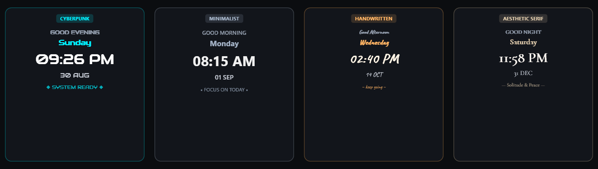

  

  
  
  
  
  
  

  <a href="https://github.com/AhmadShehada-bit/DesktopClockWidget/releases/latest"><b>🚀 Download Latest Release</b></a> •
  <a href="#-features"><b>✨ Features</b></a> •
  <a href="https://github.com/AhmadShehada-bit/DesktopClockWidget/issues/new?template=custom_widget_request.yml"><b>🧩 Request a Custom Widget</b></a> •
  <a href="https://github.com/AhmadShehada-bit/DesktopClockWidget/issues/new?template=feature_request.yml"><b>💡 Request a Feature</b></a> •
  <a href="https://github.com/AhmadShehada-bit/DesktopClockWidget/issues/new?template=bug_report.yml"><b>🐛 Report a Bug</b></a>

---

## 🌟 Overview

**DesktopClock Widget** is a lightweight, highly customizable Windows desktop clock designed for users who care about desktop aesthetics, typography, and zero-distraction utility.

Powered by a native Win32/WPF rendering engine, it delivers sub-pixel precision positioning, 217+ bundled curated fonts with instant mouse-wheel browsing, real-time visual text effects, and rock-solid layout envelopes that completely eliminate visual jitter as time advances.

---

## 🎭 Style Showcase

Whether your desktop aesthetic is cyberpunk, minimalist monochrome, warm handwritten, or editorial luxury, DesktopClock Widget adapts seamlessly:

  

---

## 📸 Screenshots

  
  

  
  

---

## ✨ Features

### 🔤 Typography & Fast Font Wheel Browsing
- **217+ Curated App Fonts**: Bundled static TrueType fonts guaranteed to render identically on every machine without system installation.
- **Rich Aesthetic Collections**: Includes **58 Handwritten fonts** (brush, marker, elegant cursive, casual script) and **50 Aesthetic fonts** (luxury serifs, modern editorial, clean geometric).
- **Fast Wheel Browsing**: Hover over any font selector and turn your mouse wheel to instantly cycle through fonts with live preview.
- **Bounded LRU Preview Cache**: Retains only recently previewed families in a 10-font bounded cache, keeping memory footprint minimal during catalog exploration.
- **Favorites & Search**: Star your top fonts for quick access and filter instantly by name, category, or source.

### 🎯 Zero-Visual-Jitter Layout Envelopes
- **Rock-Solid Envelope Slots**: Time, Date, Weekday, and Greeting elements render inside precomputed stable envelopes, eliminating the visual "jump" or width shifting caused by proportional digit changes (`2:39 PM` → `2:40 PM`, `09:59` → `10:00`).
- **Sub-Pixel Offset Control**: Adjust X and Y offsets with 0.5 DIP decimal precision using arrow keys or numeric spinners.
- **Dynamic Content Bounds**: The widget frame automatically expands to accommodate custom manual offsets without clipping.
- **Strict Anchor Invariance**: Visual alignment remains locked when time format, weekday length, or greeting text dynamically changes.

### 🎨 Visual Text Effects
- **Contour Outlines**: Customizable stroke width, color, and opacity for crisp contrast over any wallpaper.
- **Cyber Glitch**: Real-time chromatic aberration and RGB-shift animation.
- **Digital Noise**: Subtle animated grain texture overlay.
- **Per-Element Independence**: Style Greeting, Weekday, Time, and Date lines with individual fonts, sizes, colors, opacity, and casing.

### 🧩 Custom Dynamic Blocks
- **Rotating Messages**: Cycle custom motivation quotes, productivity mantras, or reminders at configurable intervals.
- **Scheduled Text**: Display time-targeted messages based on hour (e.g., Morning Focus, Evening Wind-down).
- **Aesthetic Symbols & Accents**: Decorate your clock with top and bottom geometric glyphs.
- **Dynamic Greetings**: Automatic time-aware greetings (Good Morning, Good Afternoon, Good Evening, Good Night) with custom text override.

### 🪟 Seamless Desktop Integration
- **Click-Through Transparency**: Lock mode passes all mouse events directly to Windows wallpaper and desktop icons.
- **Quick Edit Mode (`Ctrl+Alt+C`)**: Instantly unlock the widget to drag or nudge into the perfect desktop position.
- **System Tray Management**: Clean notification-area menu with single-click access to Settings and Lock/Edit toggle.
- **Startup Integration**: Optional run-at-startup setting via standard Windows registry integration.

---

## ⚡ Find Your Font in Seconds

  <b>217 fonts. No 217 clicks.</b>

Simply hover over any font selection control or catalog list in Settings and turn your mouse wheel:

- **Mouse Wheel Down**: Select next visible font
- **Mouse Wheel Up**: Select previous visible font
- **Ctrl + Wheel**: Jump 5 fonts at once
- **Shift + Wheel**: Jump 10 fonts at once
- **Wrap-Around**: Smoothly rolls from end to beginning

The desktop widget updates its preview in **< 20 ms**, letting you find your favorite typography effortlessly.

---

## ⌨️ Controls & Shortcuts

| Action | Shortcut / Input | Scope |
| :--- | :--- | :--- |
| **Toggle Edit / Lock Mode** | `Ctrl + Alt + C` | Global / Clock Window |
| **Nudge Element Position** | `Arrow Keys` (Up / Down / Left / Right) | Settings Window (Offsets) |
| **Fine Nudge (0.5 DIP)** | `Ctrl + Arrow Keys` | Settings Window (Offsets) |
| **Large Nudge (10.0 DIP)** | `Shift + Arrow Keys` | Settings Window (Offsets) |
| **Next / Previous Font** | `Mouse Wheel` Up / Down | Font Selectors & Catalog |
| **Jump 5 Fonts** | `Ctrl + Mouse Wheel` | Font Selectors & Catalog |
| **Jump 10 Fonts** | `Shift + Mouse Wheel` | Font Selectors & Catalog |
| **Navigate Font List** | `Up` / `Down` / `Page Up` / `Page Down` | Font Catalog List |
| **First / Last Font** | `Home` / `End` | Font Catalog List |

---

## 🔋 Built for 24/7 Desktop Use

DesktopClock Widget is engineered specifically for background desktop permanence:

- **One-Process Native Architecture**: Runs as a single unified lightweight executable.
- **Lazy Font Loading**: Unused font files are never preloaded at startup, keeping initial memory minimal.
- **Bounded Font Preview Cache**: Retains only recently browsed fonts during active settings sessions and purges them on close.
- **Animation Timers Sleep When Unused**: CPU consumption drops to near zero when animated effects are disabled.
- **Transparent Hardware-Accelerated Rendering**: WPF composition with zero wallpaper flickering.

> *Note: Actual idle memory consumption varies based on enabled visual effects, custom font selections, and screen resolution.*

---

## 📥 Get Started

1. **Download** the latest portable release: [**`DesktopClockWidget-portable.zip`**](https://github.com/AhmadShehada-bit/DesktopClockWidget/releases/latest).
2. **Extract** the ZIP to your preferred folder (e.g., `C:\Tools\DesktopClockWidget`).
3. **Run** `DesktopClockWidget.exe`.
4. Press `Ctrl+Alt+C` or right-click the system tray icon to open Settings.
5. **Make it yours.**

*No installer or administrative privileges required.*

---

## 🧩 Want Your Own Widget?

DesktopClock Widget is expanding into a family of customizable desktop utilities. Have an idea for another desktop widget?

  

*Popular community concepts under consideration:*
- 🌤️ **Cyber Weather Widget** (Live temperature & animated weather glyphs)
- 📊 **System Monitor Widget** (Real-time CPU, RAM, and GPU load meters)
- 🍅 **Pomodoro / Focus Timer Widget** (Clean countdown & interval tracker)
- 💬 **Daily Quotes & Productivity Hub** (Custom RSS / daily motivation feeds)

---

## 🗺️ Roadmap

- [x] **217+ Curated App Fonts** with categorized Handwritten & Aesthetic collections
- [x] **Fast Mouse-Wheel & Keyboard Font Browsing** with instant live preview
- [x] **Zero-Visual-Jitter Layout Envelopes** for stable dynamic text
- [x] **Custom Dynamic Blocks** (Rotating messages, schedules, symbols)
- [ ] 🧪 **Theme Presets & One-Click Aesthetic Profiles**
- [ ] 🧪 **Additional Custom Desktop Widget Modules** (Weather, System Metrics)
- [ ] 🗺️ **Multi-Monitor & Multi-Timezone Support**
- [ ] 🗺️ **Microsoft Store & Windows Package Manager (`winget`) Distribution**

---

## 🤝 Contributing

Contributions are warmly welcome! Please review [**CONTRIBUTING.md**](CONTRIBUTING.md) for build instructions, performance principles, and pull request workflows.

---

## 🔒 Security

Please review our [**SECURITY.md**](SECURITY.md) policy for responsible vulnerability reporting.

---

## 📜 License & Notices

- **DesktopClock Widget** source code is licensed under the [MIT License](LICENSE).
- All curated open-source fonts are distributed under the SIL Open Font License 1.1 or Apache 2.0. Full notices are documented in [**THIRD_PARTY_NOTICES.md**](THIRD_PARTY_NOTICES.md).

---

  <b>DesktopClock Widget</b> 
  <i>Your desktop. Your time. Your style.</i>

