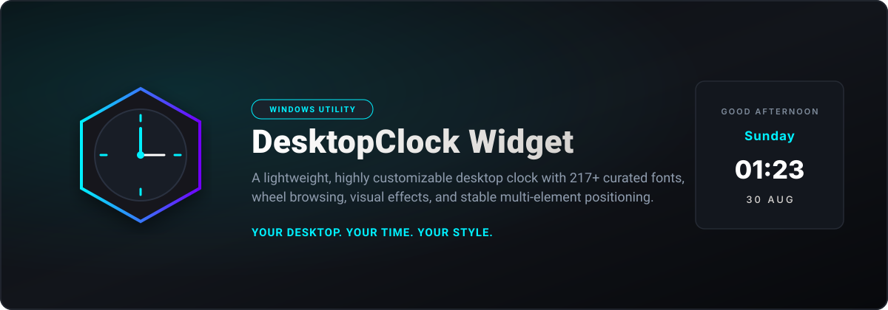
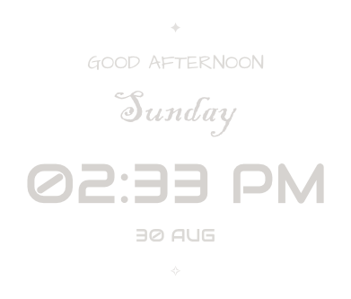
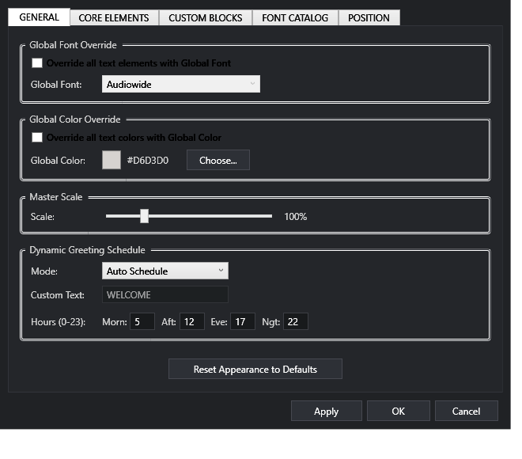
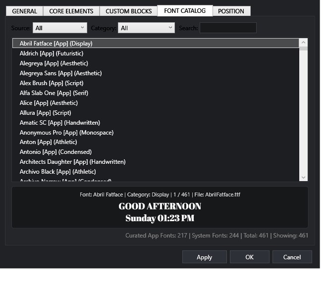
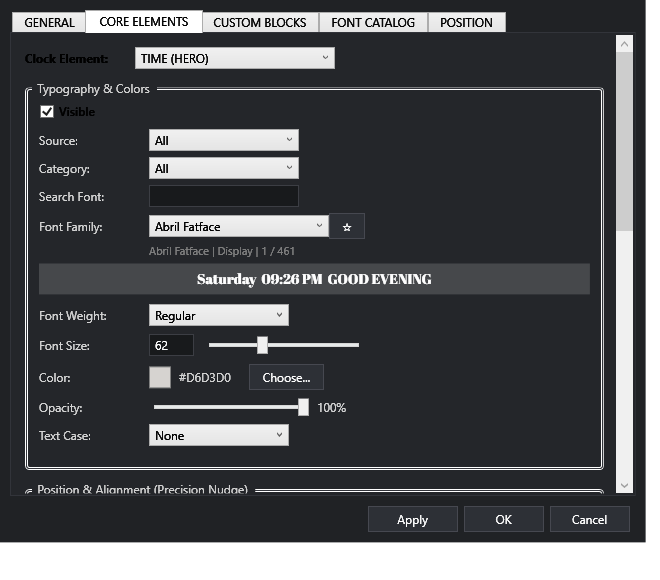

  

  
  
  
  
  
  

  <a href="https://github.com/AhmadShehada-bit/DesktopClockWidget/releases/latest"><b>🚀 Download Latest Release</b></a> •
  <a href="#-features"><b>✨ Features</b></a> •
  <a href="https://github.com/AhmadShehada-bit/DesktopClockWidget/issues/new?template=feature_request.yml"><b>💡 Request a Feature</b></a> •
  <a href="https://github.com/AhmadShehada-bit/DesktopClockWidget/issues/new?template=custom_widget_request.yml"><b>🧩 Request a Custom Widget</b></a> •
  <a href="https://github.com/AhmadShehada-bit/DesktopClockWidget/issues/new?template=bug_report.yml"><b>🐛 Report a Bug</b></a>

---

# DesktopClock Widget

**DesktopClock Widget** is a lightweight, highly customizable Windows desktop utility designed for users who want complete control over their desktop typography, layout, text effects, and aesthetic presentation.

Built with a native x86/WPF rendering engine, it delivers silky-smooth desktop performance with zero bloat, bounded preview caching, and deep personalization options.

---

## 📸 Screenshots

  
  

  
  

---

## ✨ Features

### 🔤 Typography & Font Experience
- **217+ Curated App Fonts**: Bundled, verified static TrueType families guaranteed to render identically on any Windows machine.
- **Rich Specialized Categories**: Includes **58 Handwritten fonts** (brush, marker, elegant cursive, notebook) and **50 Aesthetic fonts** (luxury serifs, modern editorial, clean geometric).
- **Fast Scroll-Wheel Browsing**: Hover and turn your mouse wheel to cycle through fonts with instantaneous live preview.
- **Bounded LRU Cache**: 10-font bounded preview cache ensures memory is automatically reclaimed during rapid catalog browsing.
- **Search & Favorites**: Pin your top fonts with star tags and filter instantly by category or source.

### 📐 Precision Layout & Positioning
- **Sub-Pixel Offset Control**: Adjust X and Y offsets with 0.5 DIP decimal precision using arrow keys or numeric spinners.
- **Adaptive Content Bounds**: Window layout dynamically expands to enclose custom offsets without clipping.
- **Strict Anchor Invariance**: Visual alignment remains locked when time format, weekday length, or greeting text dynamically changes.
- **Independent Alignments**: Mix Left, Center, and Right alignments across Greeting, Weekday, Time, and Date lines.

### 🎨 Visual Text Effects
- **Contour Outlines**: Customizable stroke width, color, and opacity for high contrast against any wallpaper.
- **Cyber Glitch**: Dynamic chromatic aberration and RGB-shift animations.
- **Digital Noise**: Subtle animated grain texture overlay.
- **Per-Element Styling**: Configure colors, opacity, casing, and effects independently for each line.

### 🧩 Custom Blocks & Dynamic Content
- **Rotating Messages**: Cycle custom motivation quotes, productivity mantras, or reminders at configurable intervals.
- **Scheduled Text**: Display time-targeted messages based on hour (e.g., Morning Focus, Evening Wind-down).
- **Aesthetic Symbols**: Accentuate your clock with top and bottom decorative glyphs.
- **Dynamic Greetings**: Automatic time-aware greetings (Good Morning, Good Afternoon, Good Evening, Good Night) with custom text override.

### 🪟 Windows Desktop Integration
- **Click-Through Transparency**: Lock mode passes all mouse events directly to Windows wallpaper and desktop icons.
- **Quick Edit Mode (`Ctrl+Alt+C`)**: Instantly unlock the widget to drag or nudge into the perfect desktop position.
- **System Tray Management**: Clean notification-area menu with single-click access to Settings and Lock/Edit toggle.
- **Startup Integration**: Optional run-at-startup setting via standard Windows registry integration.

---

## ⚡ Fast Wheel Font Browsing

  <b>Browse 217+ fonts without 217 clicks.</b>

Simply hover over any font selection control or catalog list in Settings and turn your mouse wheel:

- **Mouse Wheel Down**: Select next visible font
- **Mouse Wheel Up**: Select previous visible font
- **Ctrl + Wheel**: Jump 5 fonts at once
- **Shift + Wheel**: Jump 10 fonts at once
- **Wrap-Around**: Smoothly rolls from end to beginning

The desktop widget updates its preview in **< 20 ms**, letting you find your favorite typography effortlessly.

---

## ⌨️ Controls & Shortcuts

| Action | Shortcut / Input | Scope |
| :--- | :--- | :--- |
| **Toggle Edit / Lock Mode** | `Ctrl + Alt + C` | Global / Clock Window |
| **Nudge Element Position** | `Arrow Keys` (Up / Down / Left / Right) | Settings Window (Offsets) |
| **Fine Nudge (0.5 DIP)** | `Ctrl + Arrow Keys` | Settings Window (Offsets) |
| **Large Nudge (10.0 DIP)** | `Shift + Arrow Keys` | Settings Window (Offsets) |
| **Next / Previous Font** | `Mouse Wheel` Up / Down | Font Selectors & Catalog |
| **Jump 5 Fonts** | `Ctrl + Mouse Wheel` | Font Selectors & Catalog |
| **Jump 10 Fonts** | `Shift + Mouse Wheel` | Font Selectors & Catalog |
| **Navigate Font List** | `Up` / `Down` / `Page Up` / `Page Down` | Font Catalog List |
| **First / Last Font** | `Home` / `End` | Font Catalog List |

---

## 🔋 Performance & Resource Architecture

DesktopClock Widget is engineered for 24/7 background desktop use:

- **On-Demand Font Resolution**: Unused font files are never preloaded at startup, keeping initial memory minimal.
- **Bounded Preview Cache**: Retains only recently browsed fonts during active settings sessions and purges them on close.
- **Lightweight Idle Footprint**: Efficient Win32/WPF composition with no background browser engines or heavy runtimes.
- **Single-Process Architecture**: Runs as a single unified executable.

> *Note: Idle memory consumption varies based on enabled visual effects, custom font selections, and screen resolution.*

---

## 📥 Installation

1. Download the latest **`DesktopClockWidget-portable.zip`** from [GitHub Releases](https://github.com/AhmadShehada-bit/DesktopClockWidget/releases/latest).
2. Extract the ZIP to any folder (e.g., `C:\Tools\DesktopClockWidget` or `D:\AI\DesktopClockWidget-App`).
3. Run **`DesktopClockWidget.exe`**.
4. The clock appears on your desktop. Right-click the system tray icon or press `Ctrl+Alt+C` to configure.

*No installer or administrative privileges required.*

---

## 💡 Have an Idea?

DesktopClock Widget evolves through community ideas and real desktop setups.

- Have a feature suggestion? [**Request a Feature**](https://github.com/AhmadShehada-bit/DesktopClockWidget/issues/new?template=feature_request.yml)
- Want a brand new custom desktop utility? [**Request a Custom Widget**](https://github.com/AhmadShehada-bit/DesktopClockWidget/issues/new?template=custom_widget_request.yml)
- Found a bug? [**Report a Bug**](https://github.com/AhmadShehada-bit/DesktopClockWidget/issues/new?template=bug_report.yml)

---

## 🗺️ Roadmap

- [ ] Theme presets & one-click aesthetic profiles
- [ ] Additional custom desktop widget modules (Weather, System Metrics)
- [ ] Multiple clock instances with individual timezones
- [ ] Packaging for Microsoft Store / Windows Package Manager (`winget`)
- [ ] Community themes import & export

---

## 🤝 Contributing

Contributions are welcome! Please check out [**CONTRIBUTING.md**](CONTRIBUTING.md) for build instructions, guidelines, and pull request workflows.

---

## 🔒 Security

For security vulnerability reporting, please review our [**SECURITY.md**](SECURITY.md) policy.

---

## 📜 License & Notices

- **DesktopClock Widget** source code is licensed under the [MIT License](LICENSE).
- All curated open-source fonts are distributed under the SIL Open Font License 1.1 or Apache 2.0. Full license notices are documented in [**THIRD_PARTY_NOTICES.md**](THIRD_PARTY_NOTICES.md).
